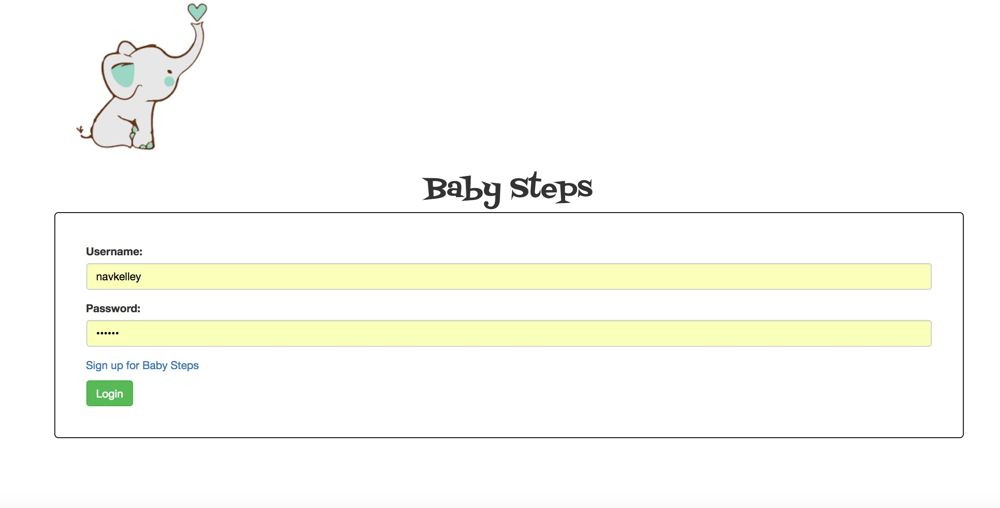
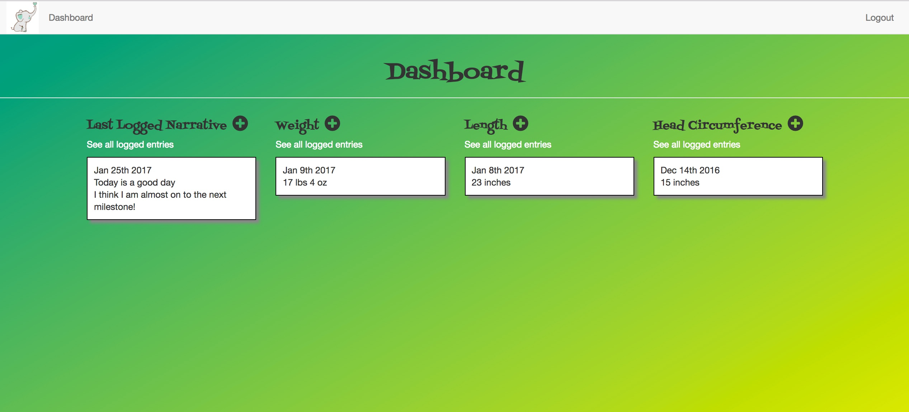
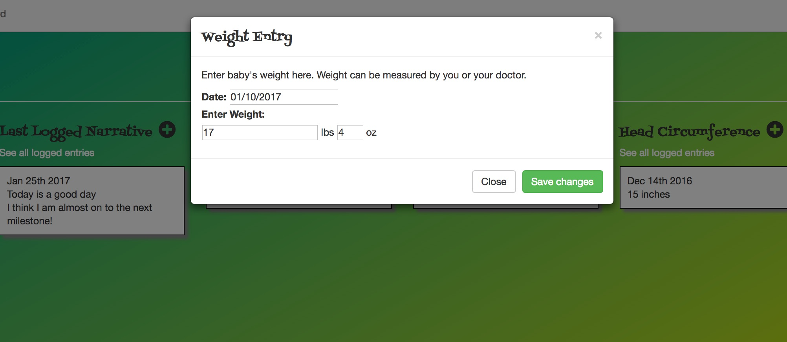
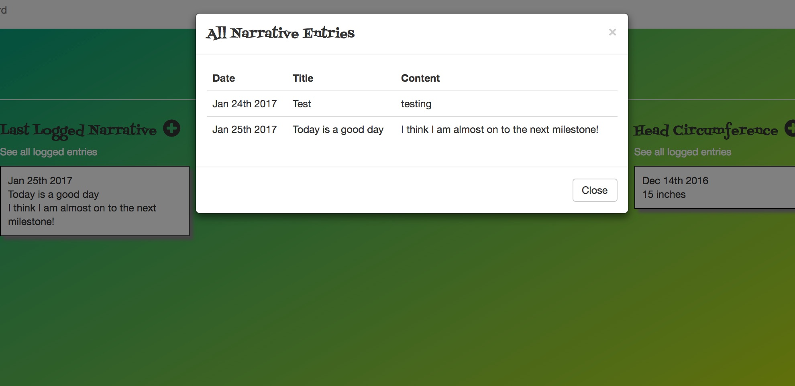

# Welcome to Baby Steps! 

Baby Steps is a project that demonstrates the utilization of server-side logic with a minimal viable client interface. In this case the user will request information from a variety of endpoints to return specified information, some cases include user login, getting measurements or narrative logs. The requests will return the specified data object or objects, which will then be parsed and displayed in the corresponding elements. User information will never be returned as a security measure. You can try the demo [here](https://evening-hollows-59256.herokuapp.com/).

### Prerequisites

You will only need to create a user profile in order to utilize the application. However, if you just want to take it for a test run you can use this username and password: 

```
Username: test-baby-steps
Password: password test
```

### Installing

To begin installation of Baby Steps first fork the repo then click the button titled "Clone or download" inside of your version of the repo. 

In your terminal (in the desired directory) type: 
```
git clone [link of repo]
```
Then make sure to install all node modules with 
```
npm install
```
Also you will want to ensure that you have a database setup locally by either installing MongoDB or if you already have MongoDB run the command 
```
mongod
```
The final step is to ensure that the server is running with 
```
nodemon server.js
```
Now you are ready to go! 

## Running the tests

To run tests for this system after installation in your terminal run 
```
mocha
``` 

### Break down into end to end tests

The tests included in this application are to ensure that components are functioning properly. Each test runs a before and after hook to pass along data to the DB it then runs async functions to ensure that data is being passed back and forth as required.  

##Sreenshots





## Built With

* [Nodejs](https://nodejs.org/api/documentation.html) - The server framework used
* [NPM](https://docs.npmjs.com/) - Dependency Management
* [Express](https://expressjs.com/) - The web development framework used
* [Heroku](https://id.heroku.com/login) - For deployment 
* [mLab](http://docs.mlab.com/) - The cloud DB 
* Vanilla Javascript
* [Babel](https://babeljs.io/) - For ES6 compatibility 
* [Passportjs](http://passportjs.org/docs) - The verification framework
* [Bcryptjs](https://www.npmjs.com/package/bcryptjs) - User security
* [Jquery](http://api.jquery.com/) - Easier handling of Javascript
* [Momentjs](https://momentjs.com/docs/) - The framework for formatting dates
* [Mongoose](https://www.npmjs.com/package/mongoose) - Easier handling MongoDB
* [Webpack](http://webpack.github.io/docs/tutorials/getting-started/) - The client side bundler

## Authors

* **[Nicole Kelley](https://github.com/navkelley)** 

## Acknowledgments

* [Ryan Bozarth](https://github.com/ryanbozarth/login-app) - For login/logout authentication 
* My son who inspired Baby Steps 
* My mentor [Patrick Ford](https://github.com/patrickford) - For support 

